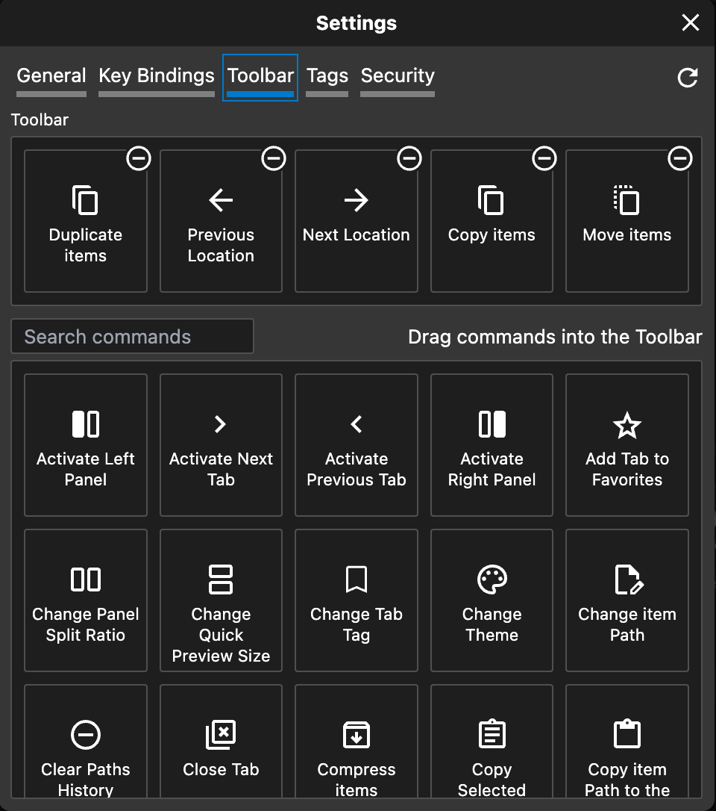

# Toolbar

Customizing your toolbar in Dirent is a straightforward process. Just head over to the Settings, where you can easily personalize your toolbar to fit your workflow. The process is as simple as dragging and dropping the actions you want to include.&#x20;

<figure><figcaption></figcaption></figure>
